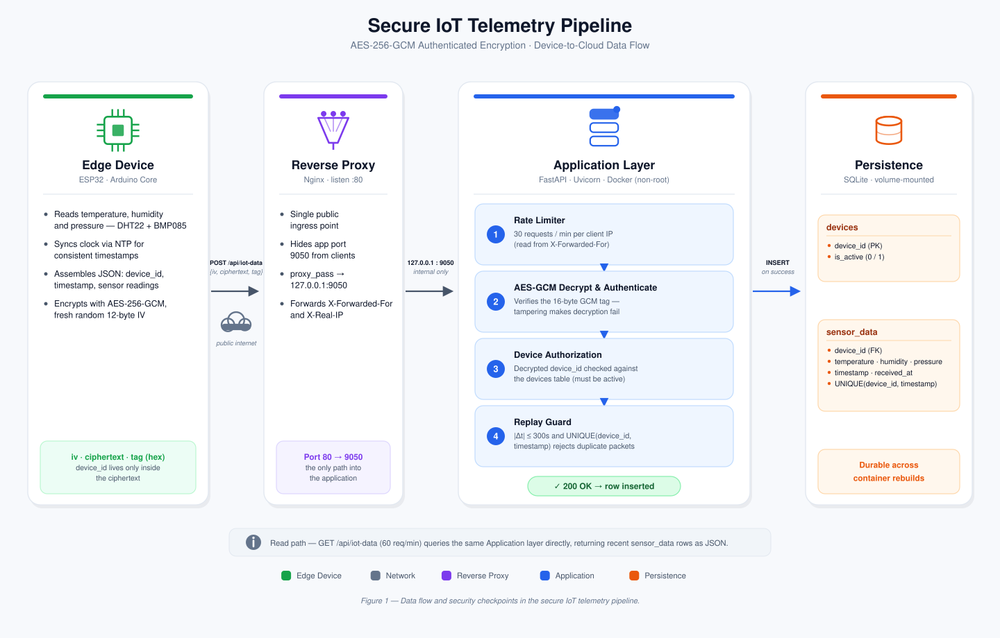

<p align="center">
  
  
  
  
  
  
</p>

<h1 align="center">Secure IoT Telemetry Pipeline</h1>
<p align="center"><em>Authenticated, replay-resistant sensor data transport from an ESP32 edge device to a FastAPI backend</em></p>

<p align="center">
  <a href="https://github.com/MRAbbasi1/iot-encryption/actions/workflows/deploy.yml">
    
  </a>
  <a href="https://github.com/MRAbbasi1/iot-encryption/blob/main/LICENSE">
    
  </a>
</p>

---

## Abstract

This repository implements and documents a compact, end-to-end secure telemetry pipeline for Internet of Things (IoT) devices. An ESP32 microcontroller samples temperature, humidity, and pressure, encrypts each reading with **AES-256-GCM** authenticated encryption, and transmits it to a **FastAPI** backend, which authenticates, validates, and persists the data.

The system is presented as a **didactic reference implementation**: the emphasis is on demonstrating — with runnable, inspectable code — the core mechanisms of confidentiality, integrity, replay resistance, and device authorization in a resource-constrained IoT context. Section 10 states explicitly which production-hardening concerns are out of scope and why, so the boundary between "demonstrated concept" and "hardened deployment" is unambiguous.

## Table of Contents

1. [System Architecture](#1-system-architecture)
2. [Security Design](#2-security-design)
3. [Deployment Architecture](#3-deployment-architecture)
4. [Project Structure](#4-project-structure)
5. [Getting Started](#5-getting-started)
6. [API Reference](#6-api-reference)
7. [Database Schema](#7-database-schema)
8. [Configuration](#8-configuration)
9. [Operations, Monitoring & Engineering Notes](#9-operations-monitoring--engineering-notes)
10. [Security Scope & Known Limitations](#10-security-scope--known-limitations)
11. [Technology Stack](#11-technology-stack)
12. [License](#license)

---

## 1. System Architecture

<p align="center">
  
</p>

<p align="center"><sub><strong>Figure 1.</strong> Data flow and security checkpoints, from sensor sampling on the ESP32 to persistence in SQLite.</sub></p>

The pipeline is organized into four layers — an **edge device**, a **reverse proxy**, an **application layer**, and a **persistence layer** — connected by a single write path (device → cloud) and a single read path (client → cloud).

### 1.1 Data Flow

| Step | Description                                                                                                                                                                                                                                     |
| ---- | ----------------------------------------------------------------------------------------------------------------------------------------------------------------------------------------------------------------------------------------------- |
| 1    | The ESP32 samples the DHT22 (temperature, humidity) and BMP085 (pressure) sensors.                                                                                                                                                              |
| 2    | A plaintext JSON object is assembled: `device_id`, `timestamp`, `temperature`, `humidity`, `pressure`.                                                                                                                                          |
| 3    | The JSON is encrypted with AES-256-GCM using a fresh, random 12-byte IV, producing `iv`, `ciphertext`, and `tag`.                                                                                                                               |
| 4    | The device sends `{iv, ciphertext, tag}` (hex-encoded) as the HTTP request body. **`device_id` is never transmitted in the outer, unencrypted envelope** — it exists only inside the ciphertext.                                                |
| 5    | Nginx terminates the connection on port 80 and forwards it to the FastAPI application on `127.0.0.1:9050`.                                                                                                                                      |
| 6    | The application decrypts the payload. A failed GCM tag verification (tampering, wrong key, corruption) aborts the request before any further processing.                                                                                        |
| 7    | `device_id` is read from the **decrypted** plaintext and checked against the `devices` table (must exist and be active).                                                                                                                        |
| 8    | The absolute difference between the device's embedded timestamp and server time is checked against a 300-second window (rejects both stale and clock-drifted-into-the-future packets).                                                          |
| 9    | A `UNIQUE(device_id, timestamp)` constraint on insert rejects any packet whose `(device_id, timestamp)` pair has already been recorded — this is what turns the timestamp window from a _plausibility_ check into an actual **replay defense**. |
| 10   | On success, the reading is persisted to `sensor_data` and the device receives `200 OK`.                                                                                                                                                         |

## 2. Security Design

### 2.1 Threat Model

**In scope** — the pipeline is designed to resist:

- Passive eavesdropping on the sensor payload (confidentiality).
- Undetected tampering with a packet in transit (integrity/authenticity, via the GCM tag).
- Replay of a previously captured, valid packet — both outside and _within_ its nominal validity window.
- Data injection from a device that is not registered, or has been administratively blocked.
- Spoofing of `device_id` via an unauthenticated, cleartext field.

**Explicitly out of scope** (see [Section 10](#10-security-scope--known-limitations) for the reasoning): compromise of a device's physical key material, confidentiality of connection metadata (timing, packet size, source IP) at the transport layer, and denial-of-service beyond basic per-client rate limiting.

### 2.2 Encryption Scheme

| Property    | Value                                                                  |
| ----------- | ---------------------------------------------------------------------- |
| Algorithm   | AES-256-GCM (Authenticated Encryption with Associated Data)            |
| Key length  | 256 bits, provisioned out-of-band and shared between device and server |
| IV length   | 12 bytes, generated fresh and random per message                       |
| Tag length  | 16 bytes                                                               |
| Wire format | Hex-encoded JSON: `{"iv": ..., "ciphertext": ..., "tag": ...}`         |

AES-GCM is used instead of a non-authenticated mode (e.g., AES-CBC) specifically because the system needs **integrity and authenticity**, not only confidentiality: a mode without a MAC would let an attacker flip ciphertext bits and have the server decrypt to plausible-looking — but false — sensor readings. The GCM tag makes any such modification detectable and causes decryption to fail outright.

### 2.3 Attack Mitigation

| Threat                   | Mitigation                                                                                                                                                                                                                     |
| ------------------------ | ------------------------------------------------------------------------------------------------------------------------------------------------------------------------------------------------------------------------------ |
| Replay attack            | Two-sided timestamp window (±300s) **combined with** a `UNIQUE(device_id, timestamp)` constraint. The window alone only bounds _staleness_; the uniqueness constraint is what actually rejects a duplicate within that window. |
| Tampering in transit     | GCM authentication tag; any bit-level modification causes decryption to fail rather than silently altering the plaintext.                                                                                                      |
| Unauthorized device      | Decrypted `device_id` is checked against the `devices` table before any data is accepted.                                                                                                                                      |
| Blocked device           | `is_active` flag on the `devices` table; inactive devices are rejected with `403`.                                                                                                                                             |
| Device identity spoofing | `device_id` is read **exclusively** from the authenticated ciphertext. No unauthenticated, cleartext device identifier is accepted anywhere in the request.                                                                    |
| Abuse / flooding         | Per-client rate limiting (`slowapi`), keyed off the real client IP via `X-Forwarded-For` rather than the reverse proxy's own address.                                                                                          |

### 2.4 Reverse Proxy Layer

Nginx sits in front of the FastAPI application for three reasons:

- **Concurrency management** — an event-driven, asynchronous front end absorbs connection churn before it reaches the application.
- **Attack-surface reduction** — the application port (`9050`) is bound to `127.0.0.1` only; Nginx is the sole public ingress point.
- **Standard ingress** — traffic is received on port 80 and forwarded internally, so the internal port and topology stay invisible to clients.

```nginx
# /etc/nginx/sites-available/iot_backend
server {
    listen 80;
    server_name <server-ip-or-domain>;

    location / {
        proxy_pass http://127.0.0.1:9050;

        proxy_set_header Host $host;
        proxy_set_header X-Real-IP $remote_addr;
        proxy_set_header X-Forwarded-For $proxy_add_x_forwarded_for;
    }
}
```

The `X-Forwarded-For` header is not cosmetic here: the application's rate limiter reads it directly to key limits per real client rather than per proxy hop (see [Section 9](#9-operations-monitoring--engineering-notes)).

## 3. Deployment Architecture

The backend runs as a single, non-root Docker container behind Nginx, redeployed automatically on every push to `main` via GitHub Actions.

**Container startup.** The image builds as `root`, but never _runs_ the application as `root`. A dedicated `entrypoint.sh` performs privilege separation at container start:

```dockerfile
FROM python:3.10-slim
WORKDIR /app
COPY requirements.txt .
RUN pip install --no-cache-dir -r requirements.txt
COPY . .
RUN useradd -m appuser
COPY entrypoint.sh /entrypoint.sh
RUN chmod +x /entrypoint.sh
EXPOSE 9050
ENTRYPOINT ["/entrypoint.sh"]
CMD ["uvicorn", "main:app", "--host", "0.0.0.0", "--port", "9050"]
```

```sh
#!/bin/sh
# entrypoint.sh — fix bind-mount ownership, then drop privileges
mkdir -p /app/data
chown -R appuser:appuser /app/data
exec su appuser -c "$*"
```

This ownership fix has to happen **at every container start**, not only at build time: `/app/data` is a host-mounted volume, so its ownership comes from the host filesystem, not from the image layers. `chown` baked into the `Dockerfile` cannot reach a directory that doesn't exist until the volume is mounted at runtime.

**Continuous deployment.** `deploy.yml` runs on every push to `main`:

```yaml
name: Deploy IoT Backend

on:
  push:
    branches: [main]

jobs:
  deploy:
    runs-on: ubuntu-latest
    steps:
      - uses: appleboy/ssh-action@v1.0.3
        with:
          host: ${{ secrets.SERVER_IP }}
          username: ${{ secrets.SERVER_USER }}
          key: ${{ secrets.SSH_PRIVATE_KEY }}
          script_stop: true
          script: |
            cd /root/iot-encryption
            git fetch origin main
            git reset --hard origin/main
            cd iot-backend
            docker build --no-cache -t iot-backend-api .
            docker stop iot-app || true
            docker rm iot-app || true
            docker run -d \
              --name iot-app \
              --restart unless-stopped \
              -p 127.0.0.1:9050:9050 \
              -v /root/iot-encryption/iot-backend/data:/app/data \
              --env-file /root/iot-encryption/iot-backend/.env \
              iot-backend-api
```

`script_stop: true` is a deliberate choice, not a default: without it, a failed step (for example, `git pull` against a directory that isn't a git repository) does not fail the workflow, and the pipeline silently redeploys the previous image while reporting success. `git reset --hard origin/main` makes each deployment reproducible from the remote state rather than dependent on the working tree's prior history.

## 4. Project Structure

```
iot-encryption/
├── docs/
│   ├── architecture.svg        # System architecture diagram (Figure 1)
│   └── architecture.png        # Raster export, for slides/offline viewing
│
├── iot-backend/
│   ├── main.py                 # FastAPI application, endpoints, rate limiting
│   ├── security.py             # AES-256-GCM decryption
│   ├── database.py             # SQLite connection and schema initialization
│   ├── entrypoint.sh           # Non-root container startup / volume ownership fix
│   ├── requirements.txt
│   ├── .env                    # backend secret parameters
│   ├── Dockerfile
│   └── data/
│       └── iot_data.db         # SQLite database
│
├── iot-device/
│   ├── iot-device.ino          # ESP32 firmware
│   └── env.h                   # firmware secret header
│
├── .github/workflows/
│   └── deploy.yml              # CI/CD: build + deploy on push to main
│
├── .gitignore
├── .dockerignore
├── LICENSE
└── README.md
```

## 5. Getting Started

### 5.1 Prerequisites

- Python 3.10+
- Docker (recommended for deployment; matches the CI/CD pipeline exactly)
- Arduino IDE or PlatformIO
- ESP32 board with DHT22 and BMP085 sensors

### 5.2 Backend — Local Execution

```bash
cd iot-backend
python -m venv venv
source venv/bin/activate        # Windows: venv\Scripts\activate
pip install -r requirements.txt

echo "AES_SECRET_KEY=<64-character hex key>" > .env

uvicorn main:app --host 0.0.0.0 --port 9050
```

### 5.3 Backend — Docker

```bash
cd iot-backend
docker build -t iot-backend-api .
docker run -d \
  --name iot-app \
  -p 127.0.0.1:9050:9050 \
  -v $(pwd)/data:/app/data \
  --env-file .env \
  iot-backend-api
```

> Binding to `127.0.0.1:9050:9050` (not `0.0.0.0`) keeps the application reachable only through Nginx. This is the same binding the CI/CD pipeline uses in production.

### 5.4 ESP32 Firmware

1. Open `iot-device/iot-device.ino`.
2. Create `env.h` alongside it:

   ```cpp
   #ifndef ENV_H
   #define ENV_H
   #define WIFI_SSID      "Your WiFi SSID"
   #define WIFI_PASSWORD  "Your WiFi Password"
   #define DEVICE_ID      "Unique device identifier"
   #define AES_KEY        {0x00, 0x01, /* ... 32 bytes total, matches AES_SECRET_KEY */}
   #define SERVER_URL     "http://<server-address>/api/iot-data"
   #endif
   ```

3. Install libraries: `Adafruit BMP085`, `DHT sensor library`, `ArduinoJson` (`mbedtls` ships with the ESP32 core).
4. Select the ESP32 board profile and upload.

### 5.5 Registering a Device

```sql
INSERT INTO devices (device_id, is_active) VALUES ('device-001', 1);
```

A reading from an unregistered `device_id` is rejected with `403` regardless of whether it decrypts successfully.

## 6. API Reference

### `POST /api/iot-data`

Accepts one encrypted sensor reading. Rate-limited to **30 requests/minute** per client IP.

**Request body** — `device_id` is intentionally absent from this schema; see [Section 1.1](#11-data-flow).

```json
{
  "iv": "a1b2c3d4e5f6a1b2c3d4e5f6",
  "ciphertext": "9f86d081884c7d659a2feaa0c55ad015...",
  "tag": "a1b2c3d4e5f6a1b2c3d4e5f6a1b2c3d4"
}
```

**Success (`200`)**

```json
{ "status": "success", "message": "Data saved." }
```

**Error codes**

| Code  | Condition                                                                                                                                                               |
| ----- | ----------------------------------------------------------------------------------------------------------------------------------------------------------------------- |
| `400` | Decryption/authentication failure, malformed JSON after decryption, missing `device_id` or `timestamp` in the decrypted payload, or timestamp outside the ±300s window. |
| `403` | `device_id` not present in the `devices` table, or present with `is_active = 0`.                                                                                        |
| `409` | Duplicate packet — this exact `(device_id, timestamp)` pair was already recorded (replay).                                                                              |
| `422` | Request body fails schema validation (missing/malformed `iv`, `ciphertext`, or `tag`).                                                                                  |
| `429` | Rate limit exceeded.                                                                                                                                                    |

### `GET /api/iot-data`

Retrieves recent readings. Rate-limited to **60 requests/minute** per client IP.

| Query parameter | Type | Default | Description                              |
| --------------- | ---- | ------- | ---------------------------------------- |
| `limit`         | int  | 20      | Number of most recent records to return. |

```json
{
  "status": "success",
  "data": [
    {
      "device_id": "device-001",
      "temperature": 25.4,
      "humidity": 48.2,
      "pressure": 101325.0,
      "timestamp": 1754668800,
      "received_at": 1754668805
    }
  ]
}
```

## 7. Database Schema

**`devices`**

| Column      | Type        | Description                                   |
| ----------- | ----------- | --------------------------------------------- |
| `device_id` | `TEXT` (PK) | Unique device identifier.                     |
| `is_active` | `INTEGER`   | `1` = authorized to send data, `0` = blocked. |

**`sensor_data`**

| Column        | Type                              | Description                                |
| ------------- | --------------------------------- | ------------------------------------------ |
| `id`          | `INTEGER` (PK, autoincrement)     | Row identifier.                            |
| `device_id`   | `TEXT` (FK → `devices.device_id`) | Reporting device.                          |
| `temperature` | `REAL`                            | Degrees Celsius.                           |
| `humidity`    | `REAL`                            | Relative humidity, %.                      |
| `pressure`    | `REAL`                            | Pascals.                                   |
| `timestamp`   | `INTEGER`                         | Unix time the device took the reading.     |
| `received_at` | `INTEGER`                         | Unix time the server received the reading. |

`UNIQUE(device_id, timestamp)` is the constraint that enforces the replay defense described in [Section 2.3](#23-attack-mitigation).

## 8. Configuration

**Backend (`.env`)**

| Variable         | Description                               | Default            |
| ---------------- | ----------------------------------------- | ------------------ |
| `AES_SECRET_KEY` | 256-bit AES key, 64-character hex string. | _required_         |
| `DB_FILE`        | SQLite database path.                     | `data/iot_data.db` |

Generate a key:

```bash
python -c "import secrets; print(secrets.token_hex(32))"
```

**Device (`env.h`)**

| Constant                     | Description                                                            |
| ---------------------------- | ---------------------------------------------------------------------- |
| `WIFI_SSID`, `WIFI_PASSWORD` | Network credentials.                                                   |
| `DEVICE_ID`                  | Must match a row in the `devices` table.                               |
| `AES_KEY`                    | 32-byte key; must match `AES_SECRET_KEY` on the server, byte-for-byte. |
| `SERVER_URL`                 | Full ingestion endpoint URL.                                           |

`env.h` contains device secrets and must never be committed with real values — see `.gitignore`.

## 9. Operations, Monitoring & Engineering Notes

### 9.1 Monitoring

```bash
# Live container logs
docker logs -f iot-app

# Confirm the application is up (not restart-looping)
docker ps

# Inspect encrypted traffic on the wire
tcpdump -i any -A -s 0 port 9050

# Pull recent stored readings
curl http://<server-ip>/api/iot-data?limit=5
```

The `tcpdump` capture is a useful demonstration artifact in itself: the payload is visible only as an opaque hex string (`iv`/`ciphertext`/`tag`), with no `device_id` or sensor value anywhere in cleartext.

### 9.2 Engineering Notes

Three non-obvious failure modes surfaced during deployment and are recorded here because they reflect real constraints of the architecture, not implementation mistakes specific to this codebase:

- **Non-root containers and bind mounts.** A `chown` in the `Dockerfile` only affects the image's own layers. A host-mounted volume (`-v host/data:/app/data`) retains the _host's_ ownership at mount time, which a non-root process inside the container may not be able to write to. This is resolved by starting the container as `root`, fixing ownership of the mount in `entrypoint.sh`, and only then dropping to `appuser` — the fix has to run on every container start, not just at build time.
- **CI/CD must fail loudly.** `appleboy/ssh-action` does not stop the workflow when an individual shell command in `script` fails, unless `script_stop: true` is set. Without it, a broken step (e.g., `git pull` in a directory that was never actually cloned with `git`) is silently swallowed, the pipeline reports ✅, and the server keeps running stale code.
- **Rate limiting behind a reverse proxy.** The default `slowapi` key function reads the direct TCP peer address. Behind Nginx, that address is always the proxy's own — every client would be rate-limited as a single pool. The fix is a custom key function that reads `X-Forwarded-For`, which is safe here specifically because the application port is bound to `127.0.0.1` and therefore reachable only through Nginx, which is the only party able to set that header.

## 10. Security Scope & Known Limitations

This system demonstrates the core encrypted-transport concept — authenticated encryption, replay resistance, device authorization — and is **not** hardened for production use. The following trade-offs are deliberate simplifications, kept out of scope to keep the reference implementation approachable:

| Limitation                                                                                                                                                                        | Production alternative                                                        |
| --------------------------------------------------------------------------------------------------------------------------------------------------------------------------------- | ----------------------------------------------------------------------------- |
| A single AES key is shared across all devices; compromise of one device's key compromises the fleet.                                                                              | Per-device key provisioning (e.g., at manufacturing/enrollment time).         |
| Transport is HTTP, not HTTPS. The payload itself is authenticated and encrypted, and `device_id` never appears in cleartext — but connection timing and volume remain observable. | TLS termination at Nginx via a Let's Encrypt certificate.                     |
| Deployment is direct-to-`main`, with no staging environment or rollback step.                                                                                                     | A staged pipeline with a rollback target (e.g., previous image tag retained). |
| Key material on the device is stored in flash, readable with physical access to the chip.                                                                                         | Hardware-backed key storage (e.g., a secure element).                         |

Natural extensions beyond this list include async database access (`aiosqlite`) for higher concurrency, server-side range validation on sensor values, and structured metrics (e.g., Prometheus) for long-running observability.

## 11. Technology Stack

| Layer         | Technology                                  |
| ------------- | ------------------------------------------- |
| Device        | ESP32, Arduino core, mbedtls, DHT22, BMP085 |
| Backend       | Python, FastAPI, Uvicorn                    |
| Encryption    | AES-256-GCM (`cryptography` library)        |
| Rate limiting | `slowapi`                                   |
| Database      | SQLite                                      |
| Reverse proxy | Nginx                                       |
| Deployment    | Docker, GitHub Actions                      |

## License

MIT — see [LICENSE](LICENSE).

## Author

[MohammadReza Abbasi](mailto:mrabbasiu@gmai.com)
